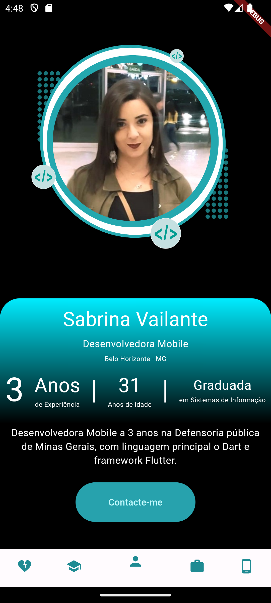
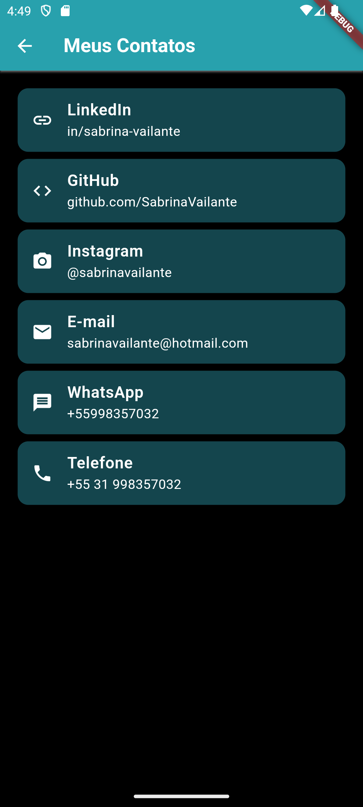
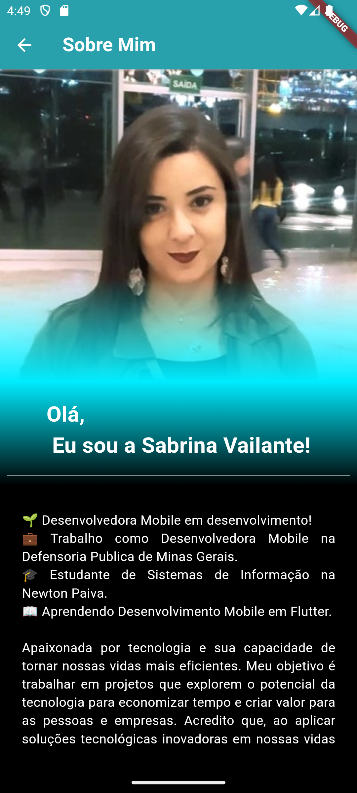
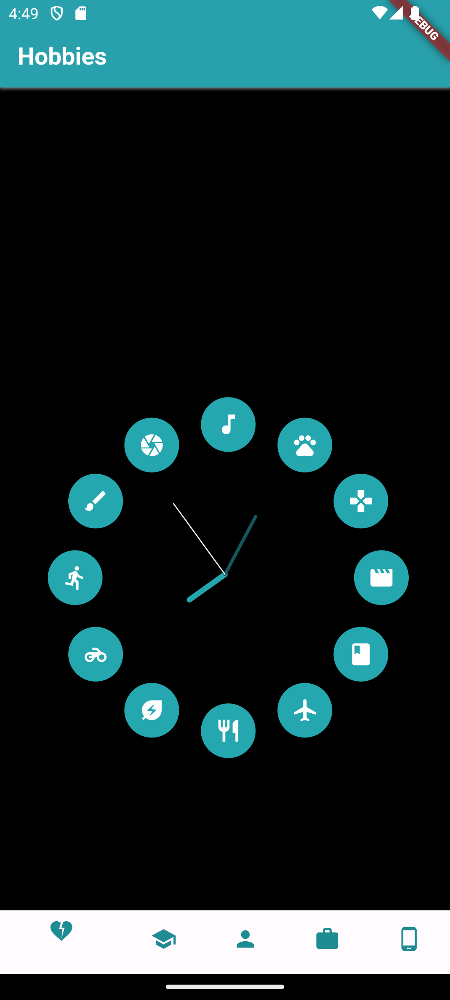
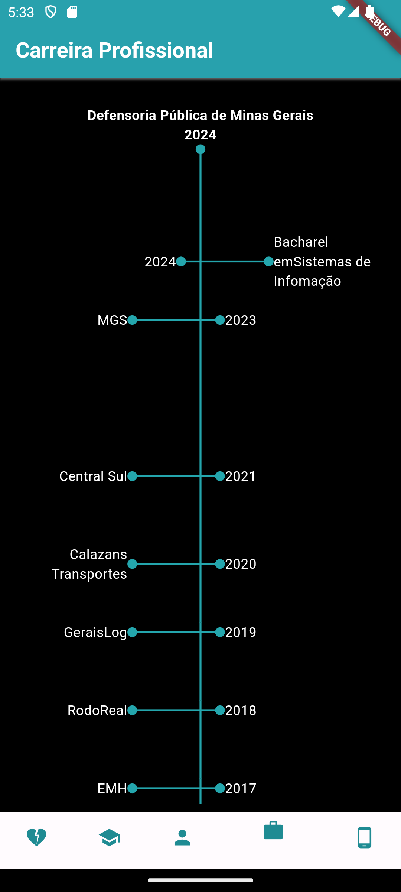
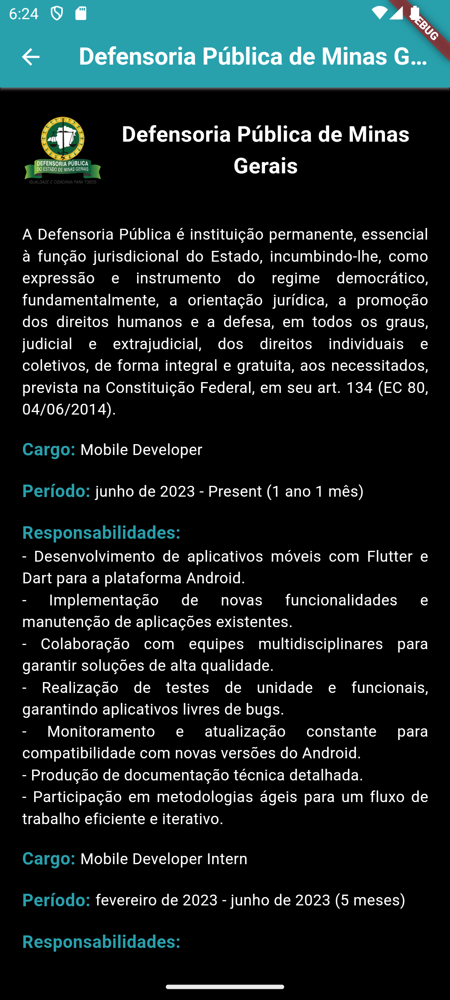
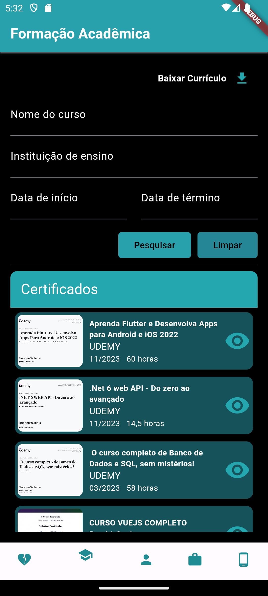
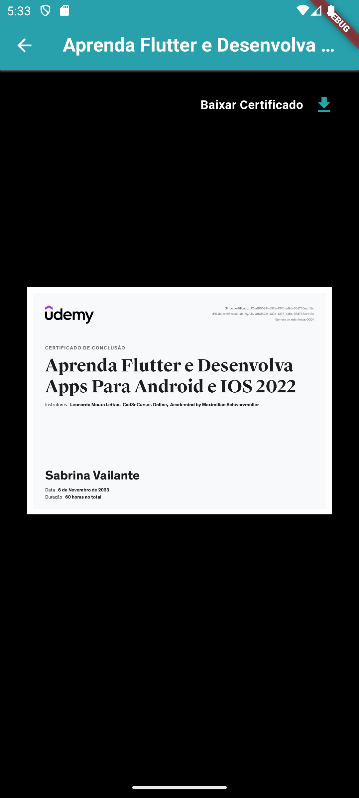
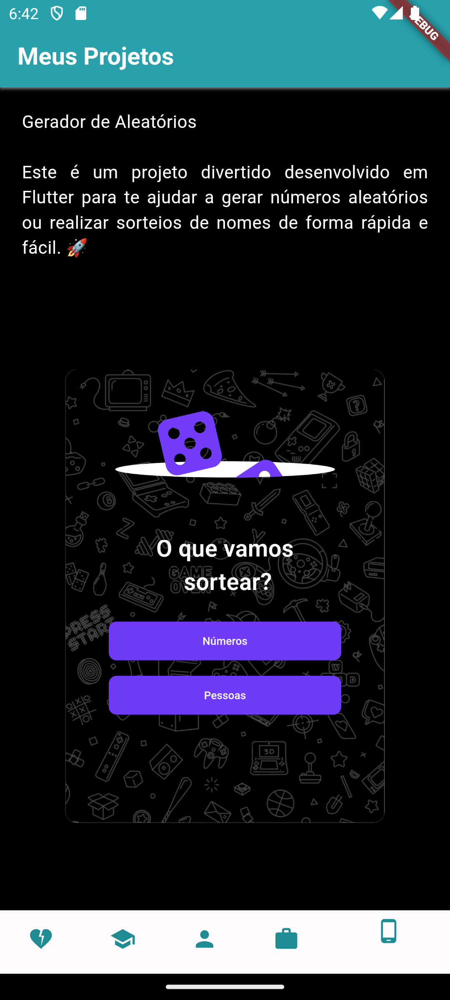
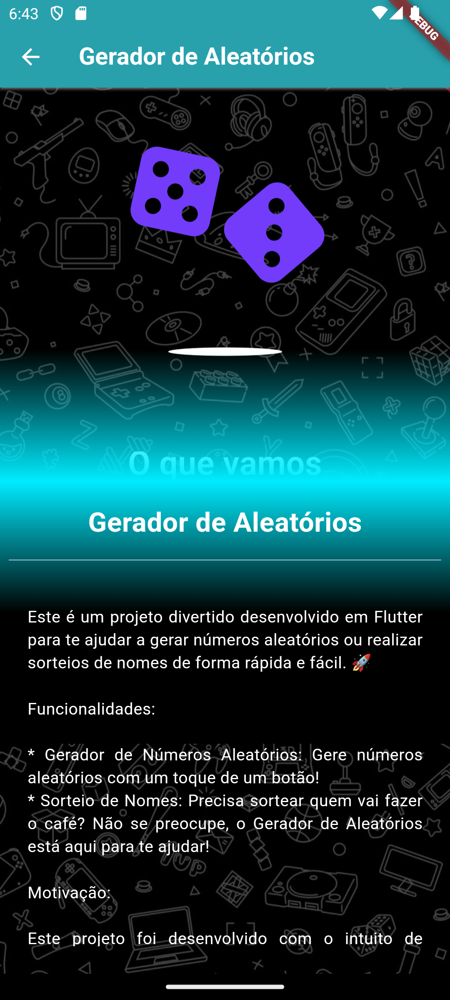

# Meu Portfólio em Flutter

Este é um aplicativo de portfólio pessoal criado com o Flutter, uma estrutura de desenvolvimento de aplicativos multiplataforma. O aplicativo apresenta informações sobre minha experiência, educação, projetos e habilidades de forma interativa e atraente.

## Capturas de Tela

Inspiração
https://www.figma.com/file/rEtRHDbbkXDVFjR8n1uQJn/Untitled?type=design&node-id=11-332&mode=design&t=7wktcog0tWUTr444-0

## Capturas de Tela

## Funcionalidades ( em desenvolvimento )

- **Tela Inicial:** Uma tela inicial com uma saudação e botões de navegação para acessar diferentes seções do portfólio.

- **Sobre Mim:** Uma tela que apresenta informações pessoais, uma breve biografia e detalhes de contato.

- **Experiência:** Uma tela que destaca sua experiência profissional, incluindo detalhes sobre cargos anteriores e suas responsabilidades.

- **Educação:** Uma tela que lista suas qualificações educacionais, incluindo instituições, cursos e anos de conclusão.

- **Projetos:** Uma tela para destacar projetos significativos, descrevendo-os brevemente.

## Como Executar

1. Certifique-se de ter o Flutter configurado em seu ambiente de desenvolvimento.

2. Clone este repositório:

3. Navegue até o diretório do projeto:

4. Execute o aplicativo:

## Personalização

????

## Contribuições

Contribuições são bem-vindas! Se você quiser contribuir para este projeto, sinta-se à vontade para abrir issues ou enviar solicitações de pull.

## Licença

